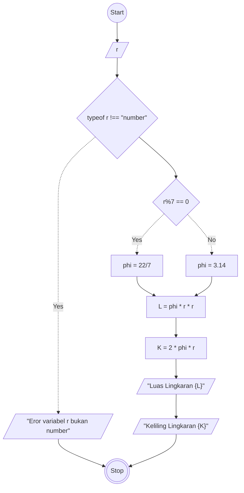

# Algorima
## Flowchart Menghitung Luas dan Keliling Lingkaran

Algoritma ini adalah untuk menghitung Luas dan Keliling dengan flowchart

```mermaid

flowchart TD
    A@{ shape: circle, label: "Start" }
    
    B@{ shape: lean-r, label: "r" }

    K@{ shape: diamond, label: 'typeof r !== "number"' }
    L@{ shape: lean-r, label: '"Eror variabel r bukan number"' }


    I@{ shape: diamond, label: "r%7 == 0" }
    J@{ shape: rect, label: "phi = 22/7" }
    C@{ shape: rect, label: "phi = 3.14" }
    D@{ shape: rect, label: "L = phi * r * r" }
    E@{ shape: rect, label: "K = 2 * phi * r" }
    F@{ shape: lean-r, label: '"Luas Lingkaran {L}"' }
    G@{ shape: lean-r, label: '"Keliling Lingkaran {K}"' }
    H@{ shape: dbl-circ, label: "Stop" }

    A-->B-->K-->I-.Yes.->J-->D
    K-.Yes.->L-->H
    I-.No .->C-->D-->E-->F-->G-->H


```