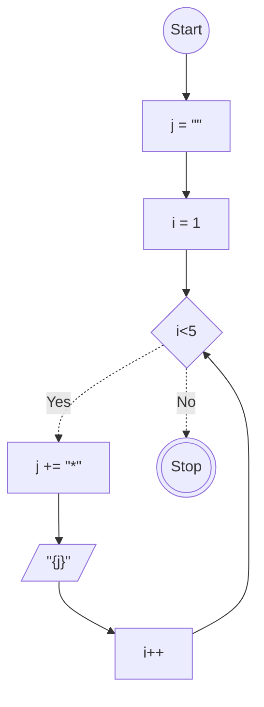

# Algoritma
## Flowchart membuat segitiga bintang

Algoritma ini menjalaskan tentang pembuatan segitiga bintang menggunakan Flowchart

```mermaid
flowchart TD
    A@{ shape: circle, label: "Start" }
    B@{ shape: rect, label: 'j = ""' }
    C@{ shape: rect, label: 'i = 1' }

    D@{ shape: diamond, label: "i<5" }
    E@{ shape: rect, label: 'j += "*"' }
    F@{ shape: lean-r, label: '"{j}"' }

    G@{ shape: rect, label: 'i++' }

    H@{ shape: dbl-circ, label: "Stop" }

    A-->B-->C-->D-.Yes.->E-->F-->G -->D-.No .->H


```
